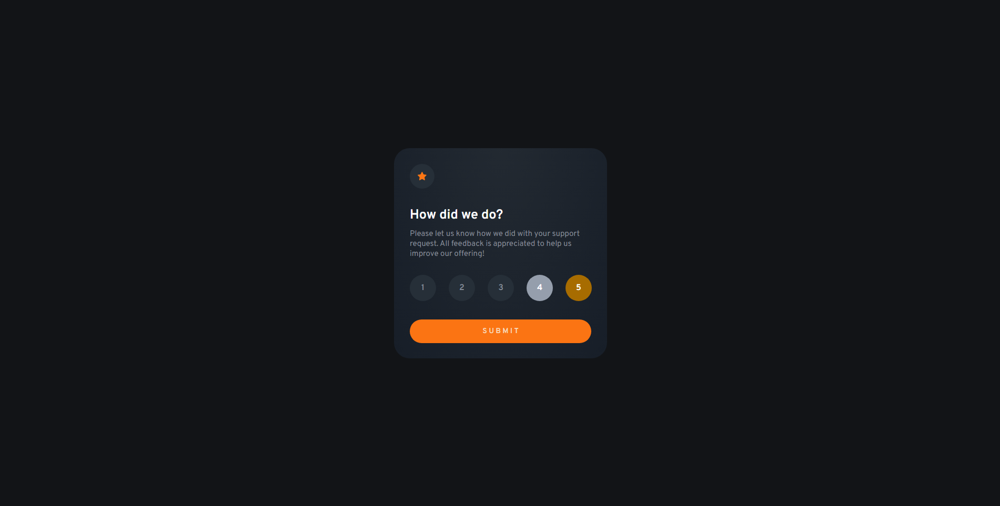

# Frontend Mentor - Interactive rating component solution

This is a solution to the [Interactive rating component challenge on Frontend Mentor](https://www.frontendmentor.io/challenges/interactive-rating-component-koxpeBUmI). Frontend Mentor challenges help you improve your coding skills by building realistic projects. 

## Table of contents

- [Overview](#overview)
  - [The challenge](#the-challenge)
  - [Screenshot](#screenshot)
  - [Links](#links)
- [My process](#my-process)
  - [Built with](#built-with)
  - [What I learned](#what-i-learned)
  - [Continued development](#continued-development)
  - [Useful resources](#useful-resources)
- [Author](#author)

## Overview
This is my Second challenge from frontendmentor. I completed it only with my html,css and javascript knowledge.
In my further challenges/projects i'll refine and perfect in categories in which I am not good at.

### The challenge

Users should be able to:

- View the optimal layout for the app depending on their device's screen size
- See hover states for all interactive elements on the page
- Select and submit a number rating
- See the "Thank you" card state after submitting a rating

### Screenshot





### Links

- Solution URL: [Add solution URL here](https://github.com/Netero03/Interactive-rating-component.git)
- Live Site URL: [Add live site URL here](https://netero03.github.io/Interactive-rating-component/)

## My process
1. Saw want things I need to do Anaylzed the objective. Maked a path to achieve the objective.
2. Saw the order in which the elements should be.
3. Wrote html code.
4. Wrote Javascript under it to Update the DOM.
5. Wrote CSS in js and css file.

### Built with

- Semantic HTML5 markup
- CSS custom properties
- javascript

### What I learned

- I learned how to anaylse a solution image and how to it can be remake it.
- I learned how the all work together the html,js and css.
- Learned how to apply js to the html and got better in it.
- I learned how to update DOM with javascript and style updated elements.
- Learned new techniques(HTML,js and CSS).

```css
.proud-of-this-css {
  background: repeating-radial-gradient(at 50% -10%, #232a32, #171e28);
}
@media (340px <= width <= 450px){  
    html{
        font-size: 80%;
    }
    }
```
```js
const buttons = document.querySelectorAll(".rating");

    let storedValue = "";

    buttons.forEach(button => {
      button.addEventListener("click", function () {

        storedValue = button.value;

        console.log("Stored Value:", storedValue);

        buttons.forEach(btn => btn.classList.remove('clicked'));
        button.classList.add('clicked');
      });

    })
```

### Continued development
- I want to continue focusing in areas like: 
  1. Font decoration and sizing and font weight. 
  2. Element placing.
  3. Colour selection.
  4. Alignments.
  5. JavaScript
  6. CSS
- In my further challenges/projects i'll refine and perfect these in categories in which i am not good at.

### Useful resources
- Internet

## Author

- Frontend Mentor - [@Netero03](https://www.frontendmentor.io/profile/yourusername)
- Twitter - [@Netero2003](https://www.twitter.com/Netero2003?s=09)
